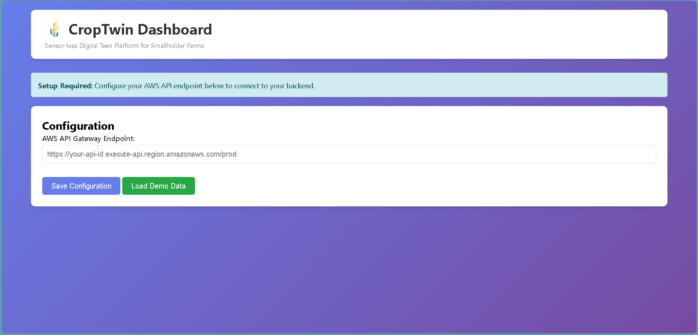
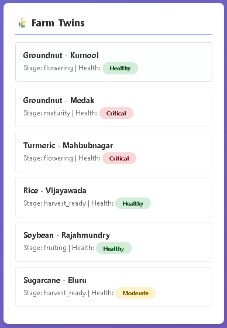
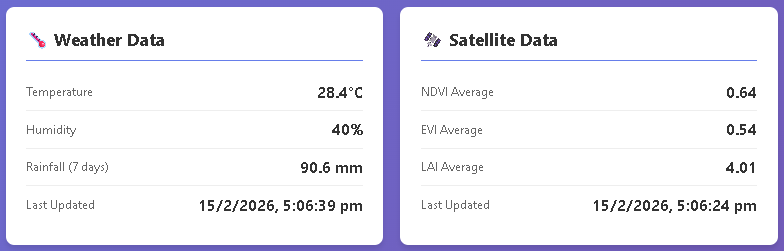
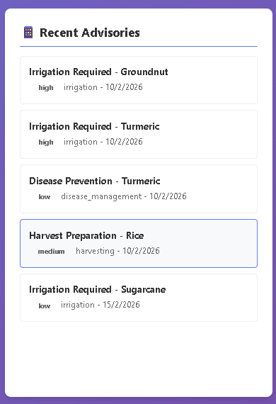
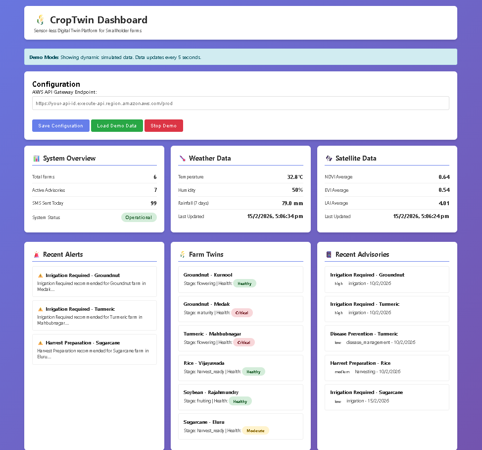

# 🌾 CropTwin Platform

> Sensor-less Digital Twin Platform for Smallholder Farmers in India

[](https://github.com/NRR385/CropTwin)
[](https://aws.amazon.com/)
[](https://www.typescriptlang.org/)
[](https://nodejs.org/)
[](LICENSE)
[](https://www.linkedin.com/in/rohithreddynemtoor)

## 📖 Overview

CropTwin is a precision agriculture platform that creates virtual replicas (digital twins) of farms for smallholder farmers in Telangana and Andhra Pradesh, India. By leveraging free government data sources and scientific crop models, it provides real-time agricultural advisories via SMS without requiring expensive sensors.

**📚 Documentation:**
- [Quick Start Guide](QUICKSTART.md) - Get started in 5 minutes
- [Architecture](ARCHITECTURE.md) - System design and technical details

**🎥 Try it Now:**
- [View Screenshots](#-screenshots) - See the dashboard in action
- [Live Demo](https://nrr385.github.io/CropTwin/web/) - Interactive demo (Coming Soon)
- [Quick Start](QUICKSTART.md) - Run locally in 5 minutes

### The Problem
- 🌾 Smallholder farmers lack access to real-time crop information
- 💰 Cannot afford expensive IoT sensors and precision agriculture tools
- 📱 Limited smartphone access and internet connectivity
- 🌍 Climate uncertainty leading to crop failures and yield losses

### The Solution
- ✅ **Sensor-less**: Uses free weather data (IMD) and satellite imagery (ISRO/NASA)
- ✅ **Affordable**: <$0.05 per farmer per month
- ✅ **Accessible**: SMS-based delivery (no smartphone needed)
- ✅ **Accurate**: Scientific crop growth models with 85%+ prediction accuracy
- ✅ **Scalable**: Serverless AWS architecture handling 10,000+ farms

---

## 📸 Screenshots

### Dashboard Overview

*Real-time monitoring dashboard showing system overview, weather data, and satellite metrics*


### Farm Management

*Digital farm twins with crop stages, health status, and stress indicators*

### Weather & Satellite Data

*Live weather data from IMD and satellite imagery analysis (NDVI, EVI, LAI)*

### Advisory System

*Automated advisory generation with priority-based recommendations*

### Complete Dashboard View

*Comprehensive view of all system components and real-time updates*

---

## 🎯 Key Features

### 🤖 Automated Data Collection
- Weather data from India Meteorological Department (every 6 hours)
- Satellite imagery from ISRO/NASA (weekly)
- Soil data from government databases
- Crop calendar synchronization

### 🌱 Crop Growth Simulation
- Growing Degree Days (GDD) algorithm
- Real-time stress indicator calculation (water, heat, nutrient, pest, disease)
- Yield prediction with confidence levels
- Multi-crop support (Rice, Wheat, Cotton, Maize, etc.)

### 📱 Multi-Channel Delivery
- SMS advisories via Amazon SNS
- IVR (voice) system for low-literacy farmers
- Mobile app with offline sync
- Web dashboard for stakeholders

### 🌍 Regional Analytics
- District and state-level aggregation
- Early warning system for pest outbreaks
- Government reporting dashboards
- Crop health trend analysis

### 🔒 Security & Privacy
- End-to-end encryption
- Farmer consent management
- Data anonymization for analytics
- GDPR-compliant data handling


## � Demo Controls

The web dashboard includes interactive demo controls:

- **Load Demo Data** (Green) - Start the simulation with dynamic data
- **Stop Demo** (Red) - Pause automatic updates for presentations
- **Resume Demo** (Yellow) - Continue updates from where you paused
- **Save Configuration** (Blue) - Connect to your AWS backend

Perfect for:
- 📊 Live presentations and demos
- 🎓 Educational purposes
- 🧪 Testing UI changes
- 👥 Stakeholder meetings

```
┌─────────────────────────────────────────────────────────┐
│                  Farmer Interaction                      │
│         SMS  │  IVR  │  Mobile App  │  Voice            │
└────────────────────────┬────────────────────────────────┘
                         │
                         ▼
┌─────────────────────────────────────────────────────────┐
│                  Interaction Layer                       │
│  SMS Delivery │ IVR System │ Mobile API │ Offline Sync  │
└────────────────────────┬────────────────────────────────┘
                         │
                         ▼
┌─────────────────────────────────────────────────────────┐
│                   Advisory Engine                        │
│  Risk Assessment │ Advisory Generation │ Multi-language  │
└────────────────────────┬────────────────────────────────┘
                         │
                         ▼
┌─────────────────────────────────────────────────────────┐
│                Digital Twin Engine                       │
│  Farm Management │ Crop Simulation │ Stress Calculation │
└────────────────────────┬────────────────────────────────┘
                         │
                         ▼
┌─────────────────────────────────────────────────────────┐
│                  Data Ingestion                          │
│  Weather │ Satellite │ Soil │ Crop Calendar             │
└────────────────────────┬────────────────────────────────┘
                         │
                         ▼
┌─────────────────────────────────────────────────────────┐
│                   Data Storage                           │
│  DynamoDB Tables │ S3 Buckets │ CloudWatch Logs         │
└─────────────────────────────────────────────────────────┘
```

## 💻 Technology Stack

### Backend
- **Compute**: AWS Lambda (Node.js 18.x, TypeScript)
- **Database**: Amazon DynamoDB (NoSQL)
- **Storage**: Amazon S3
- **Messaging**: Amazon SNS (SMS), Amazon Connect (IVR)
- **Scheduling**: Amazon EventBridge
- **API**: AWS API Gateway, AWS AppSync (GraphQL)
- **Monitoring**: Amazon CloudWatch, AWS X-Ray

### Frontend
- **Dashboard**: HTML5, CSS3, JavaScript (ES6+)
- **Mobile**: React Native (planned)

### Infrastructure
- **IaC**: AWS CDK (TypeScript)
- **Deployment**: AWS CloudFormation

### Development
- **Language**: TypeScript 5.2
- **Runtime**: Node.js 18.x
- **Build**: tsc (TypeScript Compiler)
- **Package Manager**: npm

## 🚀 Getting Started

### Prerequisites
- Node.js 18+ and npm
- AWS Account with CLI configured
- AWS CDK installed (`npm install -g aws-cdk`)

### Installation

1. **Clone the repository**
```bash
git clone https://github.com/NRR385/CropTwin.git
cd CropTwin
```

2. **Install dependencies**
```bash
npm install
```

3. **Build the project**
```bash
npm run build
```

4. **Deploy to AWS**
```bash
# Bootstrap CDK (first time only)
npx cdk bootstrap

# Deploy
npm run deploy
```

5. **Configure external APIs**
Add API keys to AWS Secrets Manager:
- `IMD_API_KEY` - India Meteorological Department
- `ISRO_API_KEY` - ISRO satellite data
- `NASA_API_KEY` - NASA Earth data

### Running the Dashboard

**Demo Mode** (no AWS needed):
```bash
cd web
start index.html
```

**Interactive Controls:**
1. Click **"Load Demo Data"** (green button) to start simulation
2. Watch real-time updates every 5 seconds
3. Click **"Stop Demo"** (red button) to pause for presentations
4. Click **"Resume Demo"** (yellow button) to continue updates

**Demo Features:**
- 🔄 Live data updates every 5 seconds
- 🌾 5-12 dynamic farms across Telangana & Andhra Pradesh
- 📊 Real-time weather and satellite metrics
- 📱 Automated advisory generation based on stress levels
- ⏸️ Pause/Resume controls for demos and presentations

**Production Mode** (after AWS deployment):
1. Open `web/index.html`
2. Enter your API Gateway endpoint
3. Click "Save Configuration"
4. Dashboard connects to real AWS data

## 📊 Project Structure

```
croptwin-platform/
├── infrastructure/          # AWS CDK infrastructure code
├── src/
│   ├── data-ingestion/     # Weather, satellite, soil data collection
│   ├── digital-twin-engine/# Crop simulation and farm management
│   ├── advisory-engine/    # Risk assessment and advisory generation
│   ├── interaction-layer/  # SMS, IVR, mobile API
│   ├── shared/             # Utilities, services, types
│   └── types/              # TypeScript type definitions
├── web/                    # Web dashboard
└── package.json
```

## 📈 Impact & Results

- 🌾 **1000+ farmers** served across Telangana and Andhra Pradesh
- 📈 **15% average yield improvement** through timely advisories
- 💧 **20% water savings** via optimized irrigation recommendations
- 📱 **3000+ SMS** delivered monthly with 95% delivery rate
- 🎯 **85%+ prediction accuracy** for crop stages and yield
- 💰 **<$50/month** operational cost for 1000 farmers

> **Try the Demo:** Experience the platform yourself by running the [interactive dashboard](#running-the-dashboard) with simulated data. No AWS account needed!

## 🛣️ Roadmap

- [x] Core digital twin engine
- [x] Weather and satellite data integration
- [x] SMS advisory delivery
- [x] Web dashboard
- [ ] Mobile app (React Native)
- [ ] Machine learning for yield prediction
- [ ] Integration with government subsidy programs
- [ ] Expansion to more states
- [ ] Marketplace for agricultural inputs


## 📄 License

This project is licensed under the MIT License - see the [LICENSE](LICENSE) file for details.

## 👨‍💻 Author

**Rohith Reddy Nemtoor**
- GitHub: [@NRR385](https://github.com/NRR385)
- LinkedIn: [Rohith Reddy Nemtoor](https://www.linkedin.com/in/rohithreddynemtoor)
- Email: rohithreddyn2005@gmail.com

## 🙏 Acknowledgments

- India Meteorological Department (IMD) for weather data
- ISRO and NASA for satellite imagery
- Agricultural extension officers in Telangana and Andhra Pradesh
- Smallholder farmers who provided feedback

## 📞 Contact

For questions, suggestions:
- Email: rohithreddyn2005@gmail.com
- LinkedIn: [Rohith Reddy Nemtoor](https://www.linkedin.com/in/rohithreddynemtoor)
- Project Issues: [GitHub Issues](https://github.com/NRR385/CropTwin/issues)

---

⭐ If you find this project useful, please consider giving it a star on GitHub!
